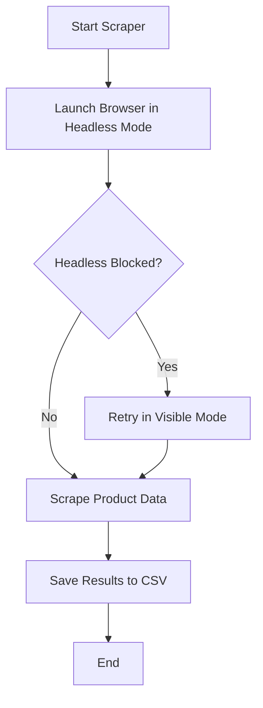

# Python-based-web-scraper
This project is a **web scraping task** completed as part of my **AI/ML Internship @ Konecta**.

## 📌 Task Overview
The goal is to build a **Python-based web scraper** that collects structured product data from an e-commerce website.

### **Objective**
- Extract product details for at least 100 items in a specific category.
- Save the results into a clean CSV file or Pandas DataFrame for further analysis.

### **Data Fields**
The scraper collects:
- Product Name / Title
- Price
- Product Rating (if available)
- Number of Reviews (if available)
- Product URL
- Image URL
- Brand (if available)

## 🛠️ Tools & Libraries
- **Python 3**
- **Selenium** – for automated browsing & handling JavaScript-rendered content
- **webdriver-manager** – to auto-install and manage ChromeDriver
- **pandas** – to store and export data to CSV
- **time / random** – to control request pacing
- **Chrome Options** – to toggle between headless and visible browsing

## 🚀 How to Run
1. Clone this repository:
   ```bash
   git clone https://github.com/yourusername/python-based-web-scraper.git
   cd python-based-web-scraper
2. Install dependencies:
   ```bash
   pip install -r requirements.txt
3. Run the scraper:
   ```bash
   python scraper.py
## 📂 Project Structure
```bash
python-based-web-scraper/
│
├── scraper.py         # Main Python script for scraping
├── requirements.txt   # List of dependencies
├── README.md          # Project documentation
└── newegg_laptops.csv # Output file (generated after running)
```
## 📊 Workflow
The scraper includes a **headless mode with fallback**:
- Starts in headless mode for speed.
- If the site blocks headless browsing, it retries in visible mode automatically.
- Saves the final results in a CSV.

## 📈 Flowchart



